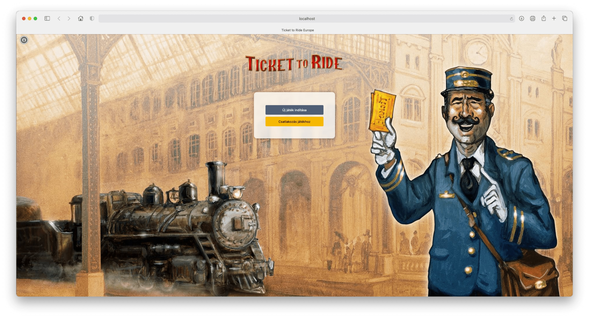
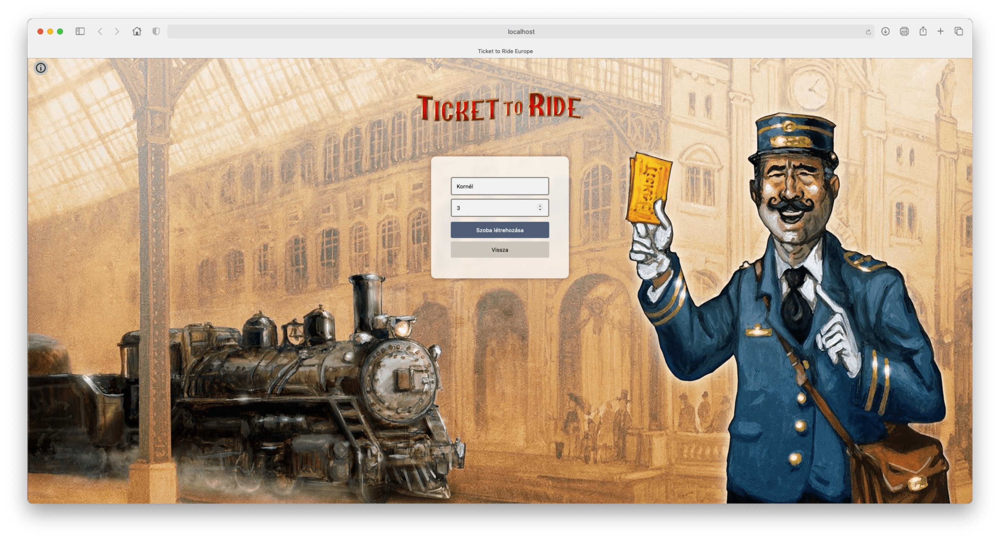
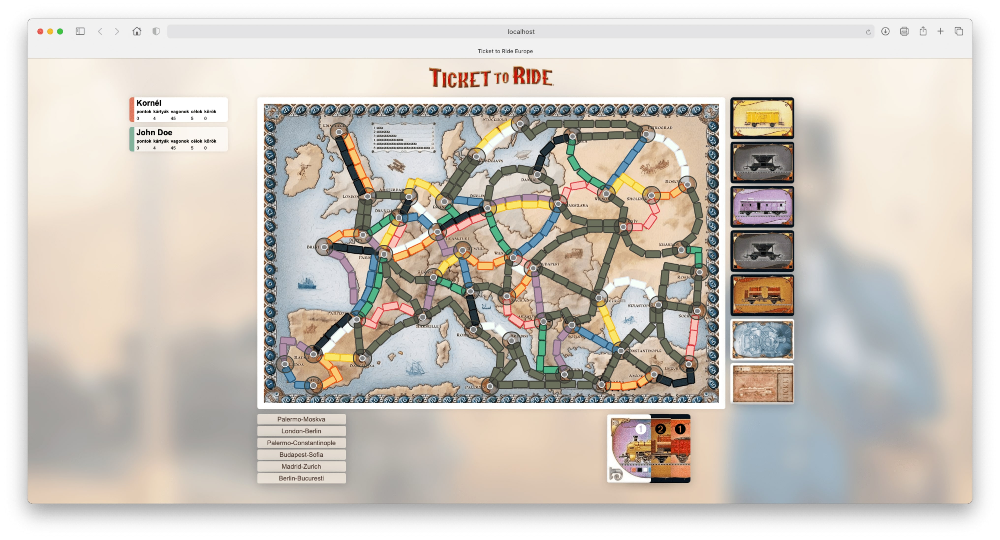

# Ticket-to-Ride-Europe
Own implementation of the Ticket to Ride Europe board game as a React app.

## Installation
To start the React application you need to install the dependencies first, then start the server.
```sh
npm install && npm start
```
After all, you can reach the server at the following address:
```sh
http://localhost:3000
```
## License

MIT

## Screenshots


> Start page.



> Create room page.


> Lobby.



> The game page.
